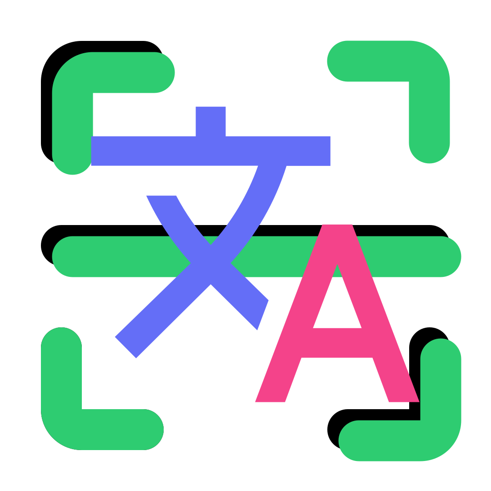

<p align="center">
<a href="https://scandocs.web.app/" target="_blank">
  
  
</a>
</p>

# Scan Docs에 대해

[Scan Docs](https://scandocs.web.app/) 는 html Canvas위에 OpenCv를 이용한 이미지 프로세싱, Tesseract을 이용한 OCR 서비스를 제공합니다.

# 기술 스택

<p>
    
    
    
    
    
    
    
    
</p>

# 특징 및 소개

1.  소개

- Scan Docs 는 오픈소스인 OpenCV  와 Tesseract을 활용하여 무료, 제한 없는 OCR 경험을 제공합니다.

2. 특징

- OpenCV를 활용하여 이미지 전처리 (Perspective Transform, Binary Tansform) 을 활용하여 OCR 정확도를 높힙니다.
- Tesseract는 무료이며 제한이 없습니다. 100여개 이상의 언어를 지원합니다.
- Html Canvas에 OCR Box를 생성하여 원하는 부분만 OCR을 작업을 수행할 수 있습니다.
- 사용한 모든 오픈소스들이  License 이므로 상업적 이용이 가능함.

3. 한계

- Browser에서 모든것을 진행하므로 온라인으로 많은 리로스를 다운받아야함. (opencv, tesseract traineddata)
- canvas page 로드될 때, OpenCV를 불러오게 함으로서 최초 로딩시 지연을 최소화 하였음.
- 가끔씩 Tesseract traineddata 받아오는 것에 지연이 있음.
- Image Data 기반이 아닌 Canvas 기반으로 Image resolution이 브라우저 크기에 따라 달라짐.
- html canvas에서 상호작용이 마우스 이벤트로만 작동함. touch에서도 작동하게 업데이트 필요.
- Opencv, tesseract 모두 python 기반이므로 js에서 작동하는데 다른 제약사항이 많음. (math.js을 이용해 perspective transform을 진행하려 했으나 이미지 보간등 추후 프로세스를 모두 개발하기에 부담이 있어 opencv 사용하였음.)

## 추후 방향

- 영역별 ROI 생성 후 Tag를 만들어 DB에 저장, 문서별 커스텀화된 OCR 박스로 자동으로 Data를 추출하도록 한다.
- BinaryTransform에서 임계값을 유저가 변경 가능하도록 하여 유저에게 많은 옵션을 제공할 수 있도록 할 예정
- Backend 구축을 통해 클라이언트의 부담을 낮춘다.

## 프로젝트 설치

```
npm install
```

## 환경설정

```
FIREBASE 환경설정 필요
VITE_FIREBASE_API_KEY=''
VITE_FIREBASE_AUTH_DOMAIN=''
VITE_FIREBASE_PROJECT_ID=''
VITE_FIREBASE_STORAGE_BUCKET=''
VITE_FIREBASE_MESSAGING_SENDER_ID=''
VITE_FIREBASE_APP_ID=''
VITE_FIREBASE_MEASUEREMNT_ID=''
```

## 개발 서버 실행

```
vite --host
```
